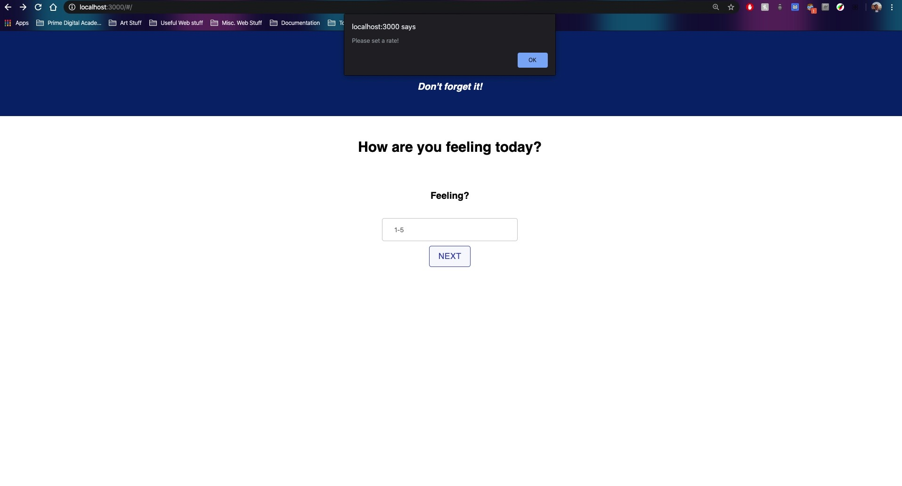
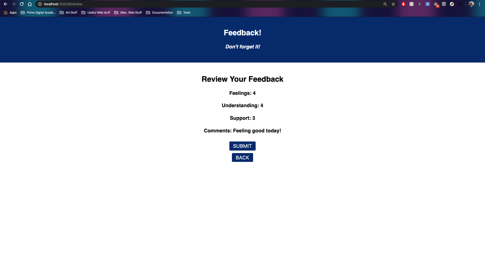

# Redux Feedback Loop

## Description

Duration: ...

Base mode:
I created a feedback form modeled after Prime's system. The feedback is collected over four views, each in it's own component. User's will input values within the range of 1-5 and one view has an optional comments area. The next button will only go to the next page if the user inputs a value, otherwise an alert will let them know that a input is required. On the review page users can go over their responses. When the user submits their response the data is sent over and stored on the local database, they are then directed to a successful submission page. The page includes a thank you note and a button that closes the loop by sending them back to the home page.

Stretch:
An additional back button is added to many of the views to allow users to change previous inputs/comments. Admin component shows feedback in a table format.

## Screen Shot

## Prerequisites

- React
- Redux
- Express
- SQL
- material-ui

## Acknowledgement

Thanks to Prime Digital Academy who equipped and helped me to make this application a reality. Thank you Caleb and Hyunsu for working together with me on the weekend assignments.
